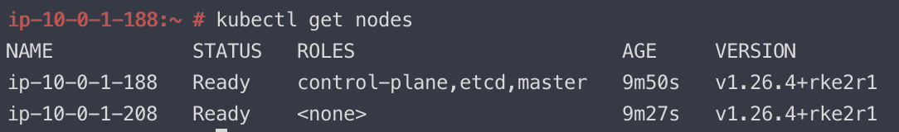

# aws-rke2-cluster
Terraform to bootstrap an RKE2 cluster in AWS

## Configuration

1. Create a `terraform.tfvars`

```
# aws-cli Profile to use
aws_profile = ""

# tags to use on the AWS resources (default_tags)
aws_tags = {
     Approver       = "my.manager"
     Environment    = "Test"
     expirationDate = "20234-01-01"
     Owner          = "me"
     Purpose        = "rke2.cluster.testing"
     Description    = "rke2.cluster.testing"
     Terraform      = "true"
}

# Prefix name that we prepend to the instance names
instance_name_prefix = "rke2-test"

# AWS EC2 instance type
instance_type = "t3.medium"

# Existing AWS SSH key-pair name - https://docs.aws.amazon.com/console/ec2/key-pairs
key_name = ""

# AWS EC2 instance volume size (in GB)
volume_size = "60"

# AWS EC2 volume type
volume_type = "gp2"

# you can find releases at https://github.com/rancher/rke2/releases
rke2_version = "v1.26.4-rc1+rke2r1"
```

2. Create your custom token for the cluster

This is the token that the client uses to join the cluster.  Keep this token safe and secure.

```bash
openssl rand -hex 32
```

3. Add output from step 2 to the below files replacing the placeholder SET_MY_TOKEN_HERE

```
user_data/run_on_server.sh
user_data/run_on_client.sh
```

## Installation

1. `terraform init`
2. `terraform plan -out tfplan.out`
3. `terraform apply tfplan.out`
4. *see known issues regarding tags* Repeat Step 2 and 3.
5. Wait for the user_data scripts to run and then the host(s) will reboot



## Known Issues

* [Provider produced inconsistent final plan / an invalid new value for .tags_all](https://github.com/hashicorp/terraform-provider-aws/issues/19583)
* Currently only SUSE AMI is supported due to the bootstrap scripts
